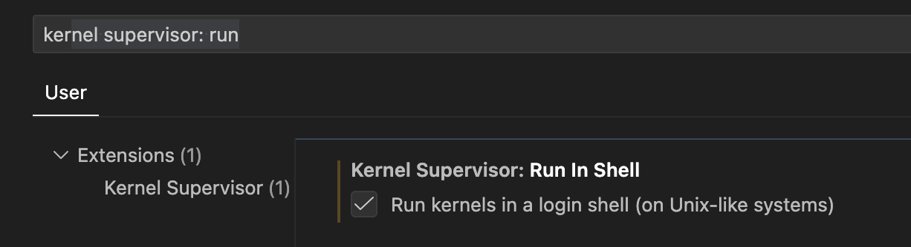
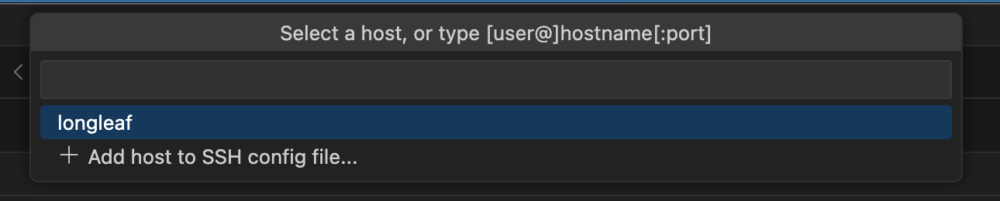

# The Reproducibility Problem {background-color="#13294B"}

## Why Does Reproducibility Matter?

Research is only as reliable as its ability to be reproduced.

::: {.incremental}
- **Science** depends on independent verification of results
- **Your future self** needs to re-run analyses months later
- **Collaborators** need to understand *and* execute your workflow
- **Reviewers & journals** increasingly require reproducible code and data
:::

::: {.fragment}
> **Reproducibility** = same data + same code → same results
:::

## The Current State of Affairs

Most computational research is **born in notebooks** but...

::: {.incremental}
- Peer-review workflows **don't natively support** notebooks as outputs
- Complex projects involve a lot of **manual work** to reach submission stage
- During this process, **reproducibility is often lost**
- Final publications **rarely capture all computations**
:::

::: {.fragment}
It *starts* reproducible, then *ends* in a PDF or Word document. 😬
:::

## What Does a Reproducible Workflow Look Like?

```
Raw Data  →  Analysis Code  →  Results  →  Report
    ↑                ↑             ↑            ↑
 Versioned       Versioned      Auto-          Auto-
 (Git/DVC)       (Git)         generated      generated
```

::: {.fragment}
**The goal:** One command to go from raw data → finished report, every time.
:::

---

# The Tools {background-color="#4B9CD3"}

## Quarto: Documents as Code

[Quarto](https://quarto.org) is an open-source scientific publishing system that:

::: columns
::: {.column width="50%"}
**Inputs**

- `.qmd` files (Quarto Markdown)
- Jupyter notebooks (`.ipynb`)
- R, Python, Julia, Observable JS
:::
::: {.column width="50%"}
**Outputs**

- HTML reports & websites
- PDF / LaTeX
- MS Word / PowerPoint
- **Presentations** (like this one!)
- Scientific manuscripts
:::
:::

::: {.fragment}
Code, narrative, and output **live in the same file** — no copy-paste.
:::

## Anatomy of a `.qmd` File

````markdown
---
title: "My Analysis"
format: html
execute:
  echo: false
---

## Results

Here is a summary of the data:

```{{r}}
library(tidyverse)
penguins |> 
  group_by(species) |> 
  summarize(mean_mass = mean(body_mass_g, na.rm = TRUE))
```
````

::: {.fragment}
**One source → many outputs**: HTML, PDF, Word, slides — all from the same `.qmd`.
:::

## The Example Project Structure

When using the embed workflow, your project has two distinct layers:

```
my-manuscript/
├── _quarto.yml          # project config
├── index.qmd            # the manuscript (narrative)
├── references.bib
└── notebooks/
    └── analysis.qmd     # the computation (figures, tables)
```

::: {.fragment}
`index.qmd` contains your **writing**.  
`notebooks/analysis.qmd` contains your **code**.  
They stay in sync automatically.
:::

## Step 1: Label Your Figures in the Notebook

In `notebooks/analysis.qmd`, every figure gets a label:

```{r}
#| label: fig-iris-sepal
#| fig-cap: "Sepal length vs. width across three iris species"

ggplot(iris, aes(x = Sepal.Length, y = Sepal.Width, color = Species)) +
  geom_point(alpha = 0.7, size = 2.5) +
  geom_smooth(method = "lm", se = FALSE) +
  scale_color_manual(values = c("#13294B", "#4B9CD3", "#99C4E2")) +
  theme_minimal()
```

::: {.fragment}
The `#| label: fig-*` cell option is the hook — it's how Quarto knows what to embed.
:::

## Step 2: Embed into the Manuscript

In `index.qmd`, reference the label with the `embed` shortcode:

```markdown
### Sepal Dimensions

Species separate clearly in sepal space (@fig-iris-sepal).


```

::: {.fragment}
Options to control what's shown:

```markdown
# Figure only (default)


# Figure + code

```
:::

## Step 3: Rich Front Matter in `index.qmd`

```yaml
---
title: "Exploring Classic R Datasets"
author:
  - name: Russ Blessing
    orcid: 0000-0000-0000-0000
    corresponding: true
    email: rblessing@unc.edu
    affiliations:
      - UNC Chapel Hill
date: today
abstract: |
  A reproducible analysis demonstrating the embed workflow...
keywords: [reproducible research, ggplot2, iris, mtcars]
bibliography: references.bib
format:
  html:
    toc: true
    code-fold: true
  pdf: default
  docx: default
---
```

::: {.fragment}
One YAML block → correctly formatted author info, abstract, and citations in every output format.
:::

## What the Rendered Manuscript Looks Like

::: columns
::: {.column width="50%"}
**`notebooks/analysis.qmd`**

Runs the code, produces figures with labeled chunks:

- `fig-iris-sepal` — sepal scatter plot  
- `fig-iris-petal` — petal boxplot  
- `fig-mtcars` — weight vs. MPG
:::
::: {.column width="50%"}
**`index.qmd`**

Pulls figures in via embed, adds narrative:

- Cross-references with `@fig-iris-sepal`  
- Auto-numbered figures  
- Captions carried through  
- Citations from `.bib` file
:::
:::

::: {.fragment}
`quarto render` → HTML + PDF + Word, all consistent, all from the same source.
:::

## The Payoff: Nothing Gets Out of Sync

::: {.incremental}
- Update a figure in `analysis.qmd` → re-render → manuscript updates **automatically**
- No re-exporting PNGs, no re-pasting into Word
- `execute: freeze: true` in `_quarto.yml` caches results — fast re-renders without re-running all code
- On Longleaf: run heavy computation as a SLURM job, commit frozen results, render the manuscript locally
:::

## The Rendered Manuscript

<iframe src="https://russblessing.github.io/positron-quarto/manuscript/"
        width="100%"
        height="520px"
        style="border: 1px solid #4B9CD3; border-radius: 6px;">
</iframe>


## Positron: The IDE Built for Data Science

[Positron](https://positron.posit.co) is a next-generation IDE from Posit (formerly RStudio), built on VS Code:

::: {.incremental}
- 🐍 **Polyglot**: First-class support for both **R and Python**
- 📓 **Quarto-native**: Quarto CLI bundled — works out of the box
- 🔍 **Variables pane**: Explore data objects interactively
- 🖥️ **Side-by-side preview**: Edit `.qmd` and see live output instantly
- 🔌 **VS Code extensions**: Huge ecosystem of add-ons
:::

## Positron vs. RStudio

| Feature | RStudio | Positron |
|---|---|---|
| Language support | R-focused | R **+** Python |
| Base platform | Custom Qt | VS Code |
| VS Code extensions | ✗ | ✓ |
| Quarto integration | ✓ | ✓ (bundled) |
| Polyglot notebooks | ✗ | ✓ |
| Variables pane | ✓ | ✓ |

::: {.fragment}
If your lab uses R *and* Python — Positron is worth exploring.
:::

## Git + GitHub: Version Control for Research

A reproducible workflow needs **version control**:

::: {.incremental}
- **Track every change** to your code, data, and documents
- **Collaborate** without emailing files back and forth
- **GitHub** hosts your project and can auto-publish reports via GitHub Pages
- Quarto projects **love Git** — built-in publishing support
:::

::: {.fragment}
```bash
# Typical workflow
git add analysis.qmd
git commit -m "Add demographic analysis section"
git push origin main
```
:::

---

# Quarto Projects & Manuscripts {background-color="#13294B"}

## The Full Complexity Spectrum

Not all projects are the same — Quarto scales with you:

| Complexity | Setup | Use case |
|---|---|---|
| **Simplest** | Single `.qmd` | Blog post, homework, quick report |
| **Simple** | `.qmd` + journal extension | Journal article with formatting |
| **Complex** | Quarto project | Multi-file analysis, websites, books |
| **Full** | `type: manuscript` | End-to-end reproducible publication |

## Quarto Manuscript Projects

Quarto 1.4+ introduced a new project type — `type: manuscript`:

::: {.incremental}
- Produce a manuscript in **multiple formats** simultaneously (HTML, PDF, Word, JATS)
- **Publish computations** from notebooks alongside the paper
- Readers can **view or interact** with your code in a virtual environment (Binder)
- Treat the notebook as a **primary scientific artifact**, not an afterthought
:::

## Setting Up a Manuscript Project

```yaml
# _quarto.yml
project:
  type: manuscript

manuscript:
  article: index.qmd

format:
  html:
    comments:
      hypothesis: true
  pdf: default
  docx: default
  jats: default

execute:
  freeze: true
```

::: {.fragment}
One project configuration → all your output formats, consistently.
:::

## Rich Front Matter

```yaml
# index.qmd YAML header
title: "La Palma Earthquakes"
author:
  - name: Jane Researcher
    orcid: 0000-0000-0000-0000
    corresponding: true
    email: jane@unc.edu
    affiliations:
      - UNC Chapel Hill
license: CC BY-SA 4.0
keywords: [seismology, earthquakes, reproducible]
abstract: |
  A fully reproducible analysis of La Palma seismic activity...
bibliography: references.bib
```

::: {.fragment}
Source YAML → correctly formatted metadata in every output format.
:::

## Embedded Computations

Rather than static figures, readers can see *how* every result was produced:

```r
#| label: fig-seismic
#| fig-cap: "Seismic activity over time"
#| echo: true

library(ggplot2)
earthquakes |>
  ggplot(aes(x = date, y = magnitude)) +
  geom_point(alpha = 0.4) +
  theme_minimal()
```

::: {.fragment}
The figure, code, and caption stay **in sync** — no copy-paste errors.
:::

---

# UNC Research Computing Resources {background-color="#4B9CD3"}

## Longleaf: UNC's HPC Cluster

[Longleaf](https://help.rc.unc.edu/longleaf-cluster/) is UNC's flagship computing cluster — **free for all UNC researchers**:

::: columns
::: {.column width="55%"}
**What it has**

- 32,000+ CPU cores
- 130 NVIDIA L40S GPUs + A100s
- 124 TB memory
- High-speed scratch storage
- SLURM job scheduler
:::
::: {.column width="45%"}
**Good for**

- Large-scale data processing
- Statistical computing
- Machine learning / deep learning
- Memory-intensive analyses
- High-throughput batch jobs
:::
:::

## Accessing Longleaf

**Option 1: Command line (SSH)**

```bash
ssh <onyen>@longleaf.unc.edu
```

**Option 2: Open OnDemand (browser-based)**

- Go to `ondemand.rc.unc.edu`
- Launch **RStudio** or **JupyterLab** directly in your browser
- No SSH required — great for interactive work

::: {.fragment}
💡 **RStudio in Open OnDemand** is a great starting point for R users new to HPC.
:::

## Running Quarto on Longleaf

Load modules and render your project in a SLURM job:

```bash
#!/bin/bash
#SBATCH -n 1
#SBATCH --cpus-per-task=4
#SBATCH --mem=16g
#SBATCH -t 2:00:00

module purge
module add r/4.4.0
module add quarto/1.6.0

# Render Quarto project
quarto render my-analysis/
```

::: {.fragment}
Large-scale data prep runs on the cluster; final rendering can happen locally or on Longleaf.
:::

## Longleaf Storage Overview

| Location | Quota | Backed Up | Use For |
|---|---|---|---|
| `/nas/longleaf/home/<onyen>` | Standard | ✓ | Code, scripts, configs |
| `/users/<o>/<n>/<onyen>` | 10 TB | ✗ | Data, project files |
| `/work/<onyen>` | Fast SSD | ✗ | Active computation |
| `/proj/<group>` | Group quota | ✗ | Shared project data |

::: {.fragment}
⚠️ `/work` is **scratch space** — files may be purged. Store results in `/users` or `/proj`.
:::

## Other UNC Resources

::: {.incremental}
- **Sycamore** — HPC cluster for tightly-coupled parallel workloads (MPI); 15,000 AMD EPYC cores
- **Open OnDemand** — Browser-based interface; launch RStudio, JupyterLab, VS Code on Longleaf
- **Virtual Computing Lab (VCL)** — On-demand virtual machines for various OS/software needs
- **Secure Research Workspace (SRW)** — For sensitive/regulated data (HIPAA, FERPA, etc.)
- **ITS Research Computing Engagement Team** — Domain experts available for consultation, **free of charge**
:::

---

# Putting It Together {background-color="#13294B"}

## A Reproducible Research Workflow at UNC

```
Local Machine (Positron)          Longleaf (HPC)
─────────────────────             ────────────────
Write .qmd analysis         →     Run data-intensive jobs
Explore data interactively        Fit large models
                            ←     Results / processed data
Render final report locally
Publish to GitHub Pages
```

::: {.fragment}
Your manuscript, code, and computational environment are all **traceable and shareable**.
:::

## What This Looks Like in Practice

::: {.incremental}
1. **Write** your analysis in `.qmd` files locally in Positron
2. **Version** everything with Git from day one
3. **Push** computationally intensive jobs to Longleaf via SLURM
4. **Pull** results back, integrate into your `.qmd` narrative
5. **Render** to HTML, PDF, and Word with a single `quarto render`
6. **Publish** to GitHub Pages or Quarto Pub automatically
:::

## Benefits for Researchers

::: columns
::: {.column width="50%"}
**For you**

- Reproduce results months later
- Onboard collaborators quickly
- Catch errors early (code + text together)
- Reuse analysis code across papers
:::
::: {.column width="50%"}
**For science**

- Transparent methods
- Shareable computational environment
- Journal-ready multiple formats
- Reviewers can verify results
:::
:::

---

# Getting Started {background-color="#4B9CD3"}

## Your Next Steps

::: {.incremental}
1. **Install Positron** → [positron.posit.co](https://positron.posit.co)  
   *(Quarto and R/Python support are bundled)*
2. **Try a Quarto document** → `File > New File > Quarto Document`
3. **Request a Longleaf account** → [help.rc.unc.edu](https://help.rc.unc.edu)
4. **Explore Quarto manuscripts** → [quarto.org/docs/manuscripts](https://quarto.org/docs/manuscripts)
5. **Check the tutorial deck** *(coming this summer)* for step-by-step setup
:::

## Resources

| Resource | Link |
|---|---|
| Quarto docs | [quarto.org](https://quarto.org) |
| Positron | [positron.posit.co](https://positron.posit.co) |
| UNC Research Computing | [help.rc.unc.edu](https://help.rc.unc.edu) |
| Longleaf cluster | [help.rc.unc.edu/longleaf-cluster](https://help.rc.unc.edu/longleaf-cluster/) |
| Quarto manuscripts talk | [mine.quarto.pub/manuscripts-conf23](https://mine.quarto.pub/manuscripts-conf23) |
| This deck's source | [github.com/russblessing/positron-quarto](https://github.com/russblessing/positron-quarto) |

## Questions?

::: {.r-fit-text}
Let's talk reproducibility 🔬
:::

::: footer
Slides built with [Quarto](https://quarto.org) + [Positron](https://positron.posit.co)
:::


## Outline

1. Workflow Overview
2. Setting up Positron
3. Longleaf Integration
4. Quarto Projects
5. Manuscript Creation
6. Website Publishing and Sharing

## Workflow Overview

### Development Environment
- **Preferred:** Positron IDE + Quarto  
    - [Install](https://positron.posit.co/download.html) Positron IDE
    - I recommend watching this Quarto [video](https://www.youtube.com/watch?v=BoiW9UWDLY0&t=573s) before going any further.
- Alternative: RStudio Sandbox (GDAL pre-loaded) + Quarto
    - Requires a request to IT for access and setup

### Data Inspection
- QGIS (visual review & QA/QC)

## Setting up Positron
Edit your ssh file on your local machine:
```bash
nano ~/.ssh/config
```
Copy/Paste replacing `YOUR_ONYEN` with your actual ONYEN:
```bash
Host longleaf
  HostName longleaf.unc.edu
  User YOUR_ONYEN
  ServerAliveInterval 60
  ServerAliveCountMax 3

Host b* c* g* t*
  User YOUR_ONYEN
  ProxyJump longleaf
  ServerAliveInterval 60
  ServerAliveCountMax 3
```
Save and exit the file (Ctrl + O, Enter, Ctrl + X).

## Longleaf Integration
Login to longleaf from your terminal:
```bash
ssh longleaf
```
Create a SLURM script for Positron sessions (type: nano interactive) and paste:
```bash
#!/bin/bash

salloc \
  --job-name=positron \
  --cpus-per-task=8 \
  --mem=24GB \
  --nodes=1 \
  --ntasks=1 \
  --time=08:00:00 \
  --partition=interact
```
Save and exit the file (Ctrl + O, Enter, Ctrl + X).

## Longleaf Integration (cont.)
Submit the SLURM script to start an interactive session:
```bash
bash interactive
```
You will see something like this:
```
salloc: Pending job allocation 31348688
salloc: job 31348688 queued and waiting for resources
salloc: job 31348688 has been allocated resources
salloc: Granted job allocation 31348688
salloc: Nodes c0402 are ready for job
```
Copy the node name (e.g., `c0402`)

## Integrating Positron with Longleaf
In Positron, go to positron > settings > and type: `kernel supervisor: run`
- Select the checkbox for "Run Kernels in a login shell"



## Integrating Positron with Longleaf (cont.)
Next type: `cmd-shift-p` or `ctrl-shift-p` to open the command palette and type: `ssh`

- You will see something like this:


Type: `<<cluster id>>.ll.unc.edu` and hit enter


## Create a Quarto Project
In Positron, go to New > New Folder from Git > and paste the URL of your GitHub repository 
Next, select New > New File > Quarto Project > Manuscript Project

- This will create a new folder with the necessary files for a Quarto manuscript project
- Use the `index.qmd` file as your main manuscript file and edit it with your content
- Use the `references.bib` file to manage your bibliography and citations
- Use the notebooks folder to create and organize your data analysis notebooks as qmd files
- Click preview to see the rendered manuscript and make adjustments as needed

## Manucript Formatting & Publishing
Many journals now have their own Quarto template for manuscript formatting, found [here](https://github.com/quarto-journals/).
Follow their instructions for adding the template as an extension.
Before publishing go to your GitHub repository.

- Navigate to Settings > Pages
- Under Branch, select gh-pages and click Save
- Your manuscript will be published at `https://<your-github-username>.github.io/<repository-name>/`

## Manuscript Formatting & Publishing (cont.)
Back is Positron your yaml should look something like this:
```yaml
project:
  type: manuscript
  resources:
    - bibliography.bib
    - notebooks/*.qmd
manuscript:
  article: index.qmd
format:
  html:
    comments:
      hypothesis: true
  docx: default
  jats: default
execute:
  freeze: true
bibliography: bibliography.bib
```

## Website Publishing and Sharing
Before publishing, make sure to commit and push your changes to GitHub.

To publish your manuscript as a website, run the following command in your terminal:
```bash
quarto publish gh-pages
```
Go to your GitHub repository and navigate to Settings > Pages and your live site should be listed. 


